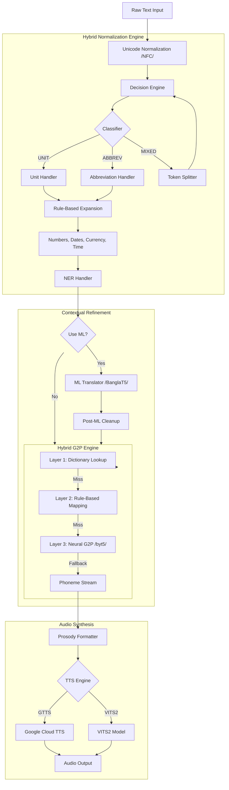
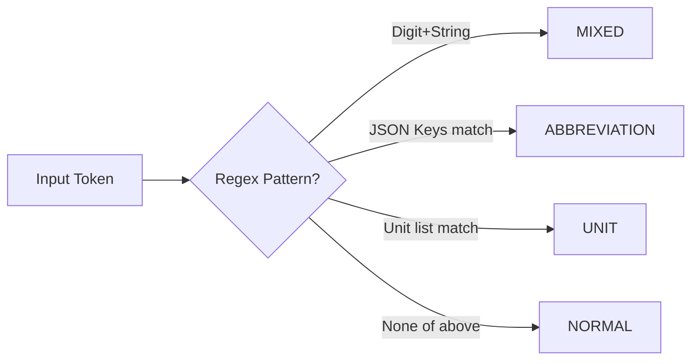
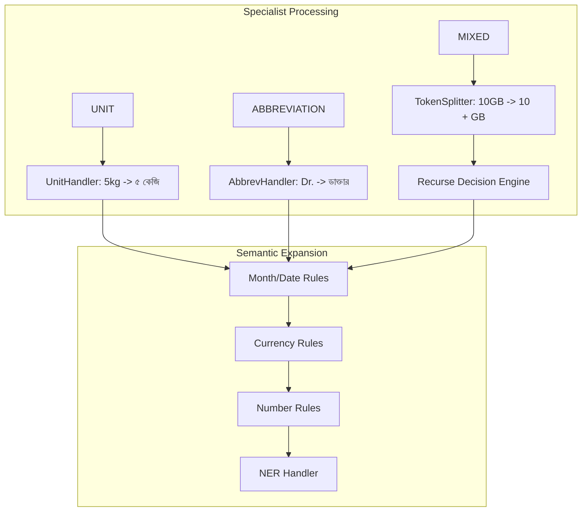
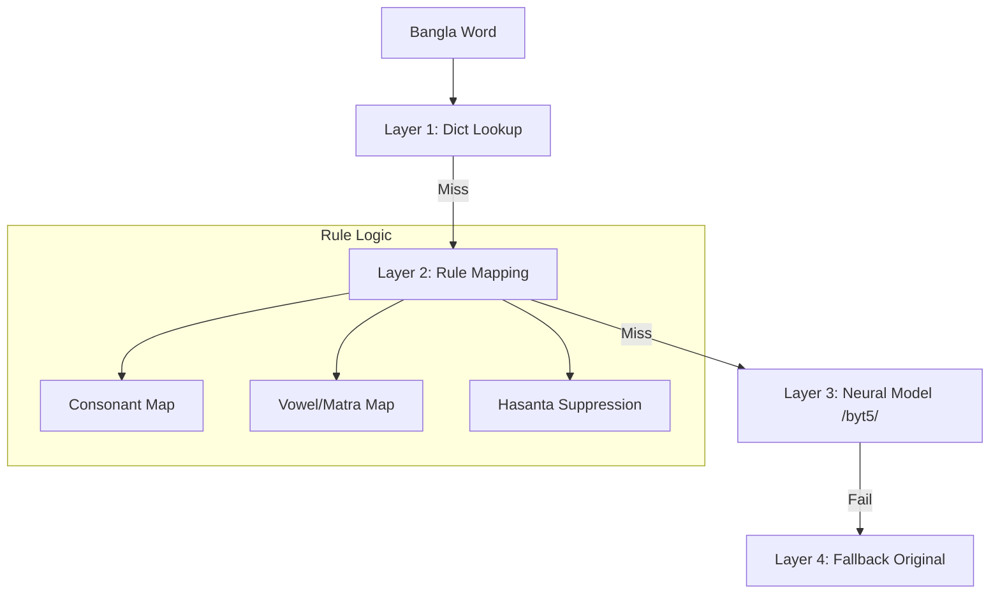
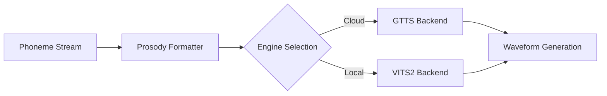

# Bangla TTS Pipeline: Architecture & Workflows

This document centralizes the visual workflows of the Bangla TTS pipeline, from raw input to final audio synthesis.

````carousel
### **1. High-Level Pipeline Architecture**
Objective: End-to-end flow from raw text to waveform.



<!-- slide -->
### **2. Step 1: Token Classification**
Objective: Route tokens to specialized handlers.



<!-- slide -->
### **3. Step 2 & 3: Specialized Handlers & Semantic Expansion**
Objective: Expand tokens into gramatically correct Bengali.



<!-- slide -->
### **4. Step 4: Hybrid G2P Engine**
Objective: Convert text to phonetic representations.



<!-- slide -->
### **5. Step 5: Synthesis & Prosody**
Objective: Final formatting and wave generation.


````
